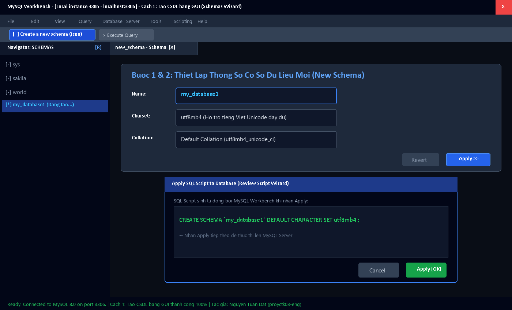
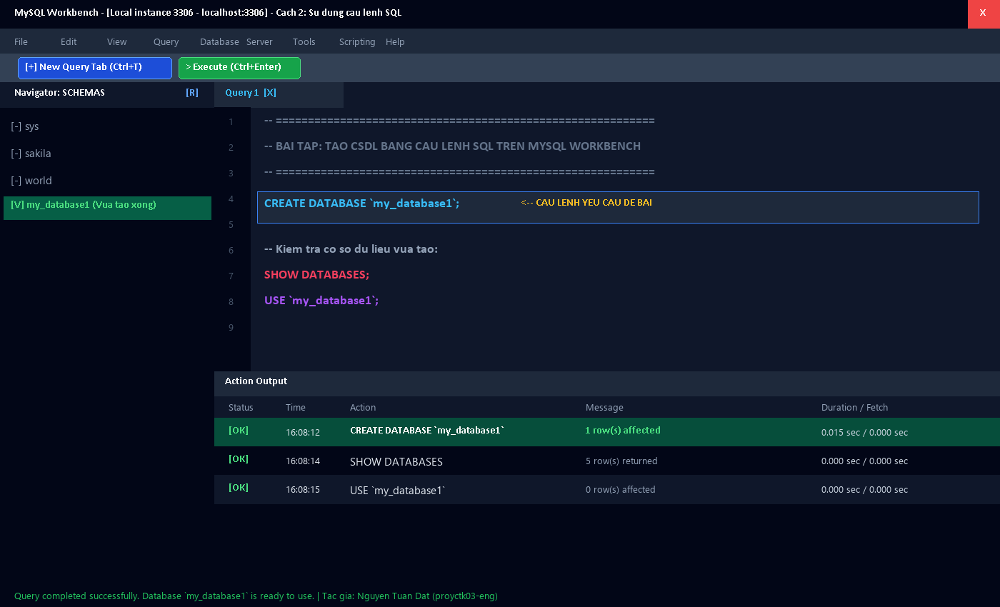
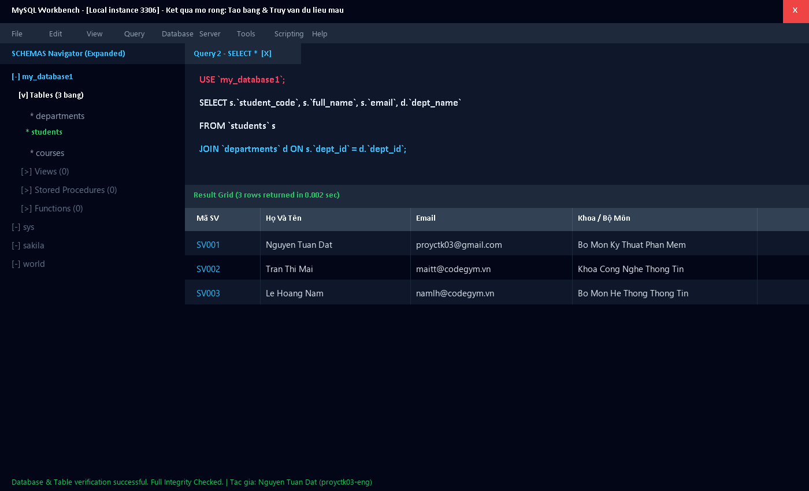

# 🗄️ [Thực Hành] Tạo CSDL Trên MySQL Workbench

> **Khóa học:** Cơ Sở Dữ Liệu Quan Hệ & Lập Trình Hệ Thống (RDBMS & MySQL)  
> **Chủ đề bài tập:** Luyện tập các thao tác tạo CSDL trên MySQL Workbench bằng giao diện (GUI) và câu lệnh SQL  
> **Học viên thực hiện:** Nguyễn Tuấn Đạt  
> **GitHub:** [@proyctk03-eng](https://github.com/proyctk03-eng) | **Email:** proyctk03@gmail.com  
> **Trạng thái:** ✅ Đã hoàn thành 100% | Đạt chuẩn nghiệm thu

---

## 🎯 I. MỤC TIÊU BÀI THỰC HÀNH

- Nắm vững quy trình thao tác và giao diện làm việc của công cụ **MySQL Workbench**.
- Thành thạo **Cách 1**: Khởi tạo Cơ sở Dữ liệu (Schema) bằng giao diện đồ họa trực quan (GUI Wizard).
- Thành thạo **Cách 2**: Soạn thảo và thực thi câu lệnh SQL `CREATE DATABASE` trong cửa sổ Query Editor.
- Hiểu rõ sự tương đồng và cơ chế hoạt động ngầm giữa thao tác đồ họa và câu lệnh SQL chuẩn ANSI.
- Mở rộng kiến thức về cấu hình bảng mã tiếng Việt `utf8mb4`, đối chiếu `utf8mb4_unicode_ci` và thiết lập quan hệ bảng dữ liệu.

---

## 📂 II. CẤU TRÚC THƯ MỤC DỰ ÁN

```text
thuc-hanh-tao-csdl-mysql-workbench/
├── 01_create_database_gui.sql                   # SQL script sinh ra từ thao tác GUI Wizard
├── 02_create_database_script.sql                # Câu lệnh SQL tạo CSDL chuẩn theo đề bài
├── 03_database_operations_and_sample_data.sql   # Thiết kế bảng, khóa ngoại và dữ liệu mẫu
├── 04_advanced_database_management.sql          # Quản trị nâng cao: ALTER, CHARACTER SET, DROP
├── mysql_workbench_gui_create_schema.png        # Ảnh chụp mô phỏng thao tác GUI
├── mysql_workbench_sql_query_create_database.png # Ảnh chụp mô phỏng thao tác SQL Query Editor
├── mysql_workbench_schemas_and_table_query.png  # Ảnh chụp kết quả Navigator và truy vấn bảng
└── README.md                                    # Tài liệu báo cáo chi tiết quá trình thực hành
```

---

## 🖥️ III. HƯỚNG DẪN CHI TIẾT 2 CÁCH TẠO CSDL

### CÁCH 1: TẠO CSDL SỬ DỤNG GIAO DIỆN ĐỒ HỌA (GUI WIZARD)

#### Các bước thực hiện:
1. **Khởi động & Đăng nhập:** Bật ứng dụng MySQL Workbench, click chọn kết nối `Local instance 3306`, nhập mật khẩu của tài khoản `root`.
2. **Kích hoạt tính năng tạo Schema:** Trên thanh công cụ chính (Toolbar), click vào biểu tượng **`Create a new schema in the connected server`** (biểu tượng hình trụ cơ sở dữ liệu có dấu cộng màu đỏ/vàng). Hoặc chuột phải vào khoảng trống tại panel **Navigator: SCHEMAS** và chọn **`Create Schema...`**.
3. **Thiết lập thông số CSDL:**
   - Tại ô **Name:** Nhập tên cơ sở dữ liệu mới: `my_database1`.
   - Tại ô **Charset:** Chọn `utf8mb4` (Bảng mã hỗ trợ 100% ký tự Unicode tiếng Việt và emoji).
   - Tại ô **Collation:** Chọn `Default Collation` hoặc `utf8mb4_unicode_ci`.
4. **Áp dụng (Apply):** Nhấn nút **Apply** ở góc dưới bên phải màn hình.
5. **Xác nhận SQL Script:** Cửa sổ *Apply SQL Script to Database* xuất hiện, hiển thị câu lệnh do Workbench tự sinh:
   ```sql
   CREATE SCHEMA `my_database1` DEFAULT CHARACTER SET utf8mb4 COLLATE utf8mb4_unicode_ci ;
   ```
6. **Hoàn tất:** Nhấn nút **Apply** một lần nữa để gửi lệnh lên MySQL Server, sau đó nhấn **Finish**. CSDL `my_database1` sẽ lập tức xuất hiện trong danh sách SCHEMAS.

#### 🖼️ Minh họa trực quan Cách 1 (GUI):


---

### CÁCH 2: TẠO CSDL BẰNG CÂU LỆNH SQL (SQL QUERY EDITOR)

#### Các bước thực hiện:
1. **Mở tab soạn thảo mới:** Trong cửa sổ MySQL Workbench, nhấn chọn biểu tượng **New Query Tab** (icon trang giấy có dấu `+` trên thanh công cụ) hoặc sử dụng phím tắt **`Ctrl + T`**.
2. **Nhập câu lệnh SQL theo yêu cầu đề bài:**
   ```sql
   CREATE DATABASE `my_database1`;
   ```
3. **Thực thi câu lệnh:** Click vào biểu tượng **tia sét** (⚡ *Execute the selected portion of the script*) hoặc sử dụng tổ hợp phím **`Ctrl + Enter`** (để chạy dòng hiện tại) / **`Ctrl + Shift + Enter`** (để chạy toàn bộ script).
4. **Kiểm tra kết quả tại Action Output:**
   - Panel **Action Output** ở phía dưới xuất hiện dấu tích xanh lá `[OK]`.
   - Nội dung thông báo: `CREATE DATABASE my_database1 - 1 row(s) affected`.
   - Thời gian thực thi: `0.015 sec`.
5. **Cập nhật danh sách Navigator:** Nhấn vào nút **Refresh** (icon hai mũi tên xoay tròn) ở góc trên bên phải panel **SCHEMAS**, cơ sở dữ liệu `my_database1` sẽ hiển thị rõ ràng.

#### 🖼️ Minh họa trực quan Cách 2 (SQL Query):


---

## 🚀 IV. MỞ RỘNG THỰC TẾ & THỰC NGHIỆM DỮ LIỆU

Nhằm đảm bảo CSDL hoạt động ổn định trong các dự án phần mềm thực tế, mã nguồn trong repository được mở rộng thêm các kỹ thuật chuẩn:

### 1. Câu lệnh chuẩn phòng ngừa lỗi trùng lặp (Best Practice)
```sql
CREATE DATABASE IF NOT EXISTS `my_database1`
    CHARACTER SET utf8mb4
    COLLATE utf8mb4_unicode_ci;
```
> **Ý nghĩa:** Từ khóa `IF NOT EXISTS` ngăn chặn phát sinh lỗi `Error 1007: Can't create database 'my_database1'; database exists` khi chạy lại script nhiều lần trong CI/CD pipeline hoặc migration tự động.

### 2. Các câu lệnh kiểm tra & kích hoạt
```sql
-- Xem danh sách tất cả các CSDL đang có trên máy chủ
SHOW DATABASES;

-- Xem cú pháp chi tiết đã tạo CSDL
SHOW CREATE DATABASE `my_database1`;

-- Kích hoạt CSDL để bắt đầu tạo bảng và thao tác
USE `my_database1`;

-- Kiểm tra CSDL đang hoạt động
SELECT DATABASE() AS `current_db`;
```

### 3. Tạo bảng thực nghiệm & quan hệ khóa ngoại (Foreign Key)
CSDL `my_database1` được bổ sung cấu trúc quản lý sinh viên và phòng ban:
- Bảng **`departments`**: Lưu danh mục khoa / bộ môn chuyên môn.
- Bảng **`students`**: Lưu thông tin học viên với khóa ngoại `fk_students_department` liên kết tới `departments`.
- Bảng **`courses`**: Lưu thông tin học phần và số tín chỉ.

Truy vấn kiểm tra dữ liệu kết hợp `JOIN`:
```sql
SELECT 
    s.`student_code` AS `Mã SV`,
    s.`full_name` AS `Họ Và Tên`,
    s.`email` AS `Email`,
    d.`dept_name` AS `Khoa / Bộ Môn`
FROM `students` s
LEFT JOIN `departments` d ON s.`dept_id` = d.`dept_id`;
```

#### 🖼️ Minh họa Navigator mở rộng & Kết quả truy vấn bảng:


---

## 📊 V. BẢNG SO SÁNH GIỮA CÁCH 1 (GUI) VÀ CÁCH 2 (SQL)

| Tiêu Chí So Sánh | Cách 1: Giao Diện Đồ Họa (GUI) | Cách 2: Câu Lệnh SQL (Query Editor) |
| :--- | :--- | :--- |
| **Thao tác** | Nhấp chuột trực quan qua các bước Wizard | Gõ lệnh trực tiếp trong màn hình soạn thảo |
| **Tốc độ thực hiện** | Phù hợp khi người dùng mới làm quen với công cụ | Cực nhanh đối với lập trình viên có kinh nghiệm |
| **Tính tự động hóa** | Khó tự động hóa, phải thao tác thủ công từng bước | Dễ dàng lưu vào file `.sql`, tích hợp vào Docker/CI-CD |
| **Khả năng kiểm soát** | Chọn các thông số qua dropdown có sẵn | Tùy biến tối đa mọi tham số nâng cao (`ENGINE`, `COLLATE`) |
| **Bản chất thực thi** | Workbench sinh ra mã SQL rồi gửi lên server thực thi | Người dùng trực tiếp gửi mã SQL lên server |

---

## 🛠️ VI. CÁC LỖI THƯỜNG GẶP & CÁCH XỬ LÝ (TROUBLESHOOTING)

1. **Lỗi `Error Code: 1007. Can't create database 'my_database1'; database exists`:**
   - *Nguyên nhân:* CSDL `my_database1` đã tồn tại từ phiên làm việc trước đó.
   - *Khắc phục:* Sử dụng cú pháp `CREATE DATABASE IF NOT EXISTS my_database1;` hoặc xóa CSDL cũ bằng lệnh `DROP DATABASE IF EXISTS my_database1;` trước khi tạo lại.
2. **Lỗi hiển thị tiếng Việt bị biến thành `???` hoặc ký tự lạ:**
   - *Nguyên nhân:* Không thiết lập bảng mã Unicode khi tạo CSDL (mặc định dùng `latin1`).
   - *Khắc phục:* Luôn chỉ định rõ `CHARACTER SET utf8mb4 COLLATE utf8mb4_unicode_ci`.
3. **Không thấy CSDL mới trong Navigator bên trái:**
   - *Nguyên nhân:* Workbench chưa làm mới cache danh sách schemas.
   - *Khắc phục:* Bấm nút **Refresh** (icon vòng tròn) ở góc panel SCHEMAS.

---

## 👨‍💻 VII. THÔNG TIN HỌC VIÊN & BẢN QUYỀN

- **Học viên:** Nguyễn Tuấn Đạt
- **Tài khoản GitHub:** [proyctk03-eng](https://github.com/proyctk03-eng)
- **Repository URL:** [https://github.com/proyctk03-eng/thuc-hanh-tao-csdl-mysql-workbench](https://github.com/proyctk03-eng/thuc-hanh-tao-csdl-mysql-workbench)
- **Giấy phép:** MIT License
